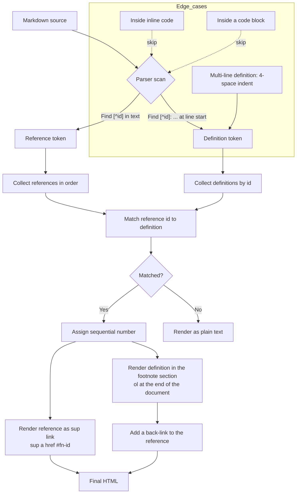

# Footnotes, a Markdown reference

Footnotes let an author attach notes, citations or asides to a passage without interrupting the main line of the text. They are **not** part of core CommonMark; both GitHub Flavored Markdown (GFM) and Pandoc support them as an extension. Most modern Markdown editors, MerMark included, follow the same syntax.

---

## 1. Syntax

### 1.1 Reference footnote

A footnote has two parts: the **reference** placed in the text, and the **definition** placed elsewhere in the document.

```markdown
Here is a paragraph with a footnote.[^1]

[^1]: The footnote text.
```

This renders as a superscript `¹` next to the word "footnote", plus a numbered list at the end of the document holding the text and a back-link (`↩`) to the reference.

### 1.2 Named labels

Identifiers can be **numbers** or **words**. Named labels are recommended in long documents because they survive reordering.

```markdown
Export quality matters.[^export]

[^export]: Check one real export before you share it.
```

In the final render, named labels are numbered sequentially anyway; the label only exists to match a reference to its definition.

### 1.3 Inline footnotes (Pandoc only)

Pandoc supports a shorthand where the footnote text is written directly at the reference:

```markdown
Here is an inline footnote.^[Renders as footnote number 1.]
```

GFM and most other parsers do **not** support this form.

### 1.4 Multi-line and multi-block definitions

Continuation lines must be indented by **4 spaces** (or one tab). This lets a footnote hold several paragraphs, lists or code:

```markdown
[^multi]: First line of the footnote.
    A continuation line, still part of the same footnote.

    A second paragraph (blank line plus 4-space indent).
```

---

## 2. Identifier rules

- Identifiers **cannot** contain spaces, tabs, newlines, or the characters `^`, `[`, `]`.
- Most parsers treat them as case-sensitive.
- A definition with no matching reference is silently dropped (or left as plain text, depending on the parser).
- A reference with no matching definition renders literally, so `[^missing]` stays visible.
- Several references to the same id are allowed; the definition renders once and back-links to each reference.

---

## 3. Placement rules

Footnote **definitions** live at the top level of the document flow. They break when nested inside:

- list items
- block quotes
- tables

Risky:

```markdown
- A top-level item[^1]
  [^1]: The footnote text     <-- nested in a list, may not parse
```

Safe:

```markdown
- A top-level item[^1]

[^1]: The footnote text        <-- document level, always parses
```

References themselves may appear anywhere inline text is allowed: paragraphs, lists, table cells, headings.

---

## 4. Edge cases

### 4.1 Inside inline code

`` `[^1]` `` is never read as a reference. Inline code is opaque to the footnote parser.

### 4.2 Inside a code block

```
[^1]: This line stays literal, code blocks switch footnote parsing off.
```

### 4.3 A document with no footnotes

A document with no references and no definitions renders normally, with no footnote section appended.

---

## 5. GFM compared with Pandoc

| Feature                            | GFM       | Pandoc    |
|------------------------------------|:---------:|:---------:|
| `[^label]` reference + definition  | ✓         | ✓         |
| Inline `^[...]`                    | ✗         | ✓         |
| Multi-paragraph footnotes          | limited   | ✓         |
| Status                             | extension | extension |

For portability between renderers, stick to reference-style footnotes with named labels, and indent continuation lines by 4 spaces.

---

## 6. How a parser processes footnotes



---

## 7. Examples (live in this document)

This is a paragraph with a simple footnote[^1]. The reference shows up as a superscript number.

Here is another paragraph with a named footnote[^note].

You can use several footnotes[^2] in the same paragraph[^3]. They are numbered sequentially.

A footnote with **bold** text in its body[^4].

Footnotes are common in academic writing[^5] and in technical documentation[^2]. Note that `[^2]` is referenced twice.

Multi-line definitions are supported[^multi].

---

## 8. Export notes

Footnotes are extension syntax, so the exported result depends on the renderer:

- **HTML**: `<sup><a href="#fn-id">N</a></sup>` plus an `<ol>` of definitions.
- **PDF / LaTeX**: real footnotes at the bottom of the page via `\footnote{}`.
- **DOCX**: native Word footnotes (bottom of the page) via Pandoc.
- **Plain Markdown previews without the extension**: rendered as the literal text `[^id]`.

Always test a real export before relying on placement.

---

[^1]: The first footnote. A simple single-line definition.
[^note]: A footnote with a named label instead of a number.
[^2]: The second footnote, referenced several times in the document.
[^3]: A third footnote, checking sequential numbering.
[^4]: Footnote text can contain **bold**, *italic* and `code`.
[^5]: See: Markdown Extended Syntax, available in most Markdown parsers.
[^multi]: This is the first line of a multi-line footnote.
    This is a continuation line (indented by 4 spaces).
    And one more continuation line.

---

## Sources

- [Pandoc User's Guide](https://pandoc.org/MANUAL.html)
- [Pandoc 8.19 Footnotes](https://pandoc.org/demo/example33/8.19-footnotes.html)
- [Markdown Footnote Guide (GFM vs Pandoc)](https://md2word.com/en/markdown-footnote)
- [pandoc_markdown(5) manpage](https://manpages.ubuntu.com/manpages/trusty/man5/pandoc_markdown.5.html)
